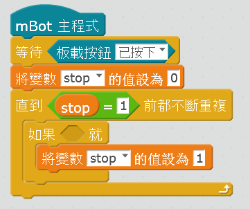
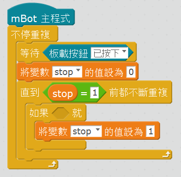
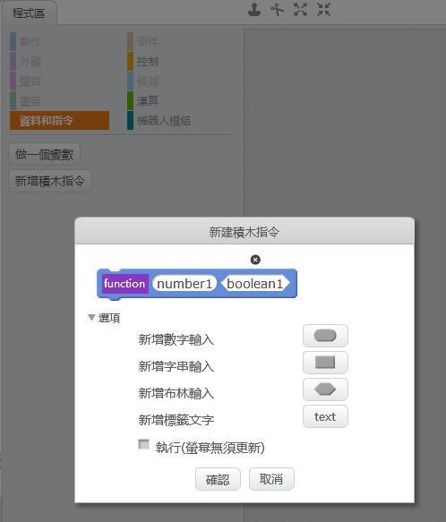
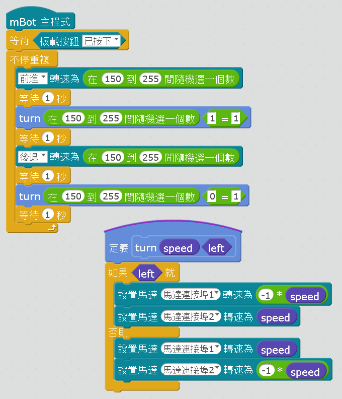
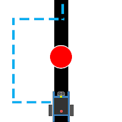
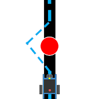
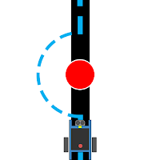
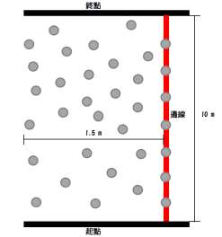

[//]: # "slide Markdown for remark"

# 自動停車

- 前進到並檢查超聲波感應器回傳
- < 50cm 時亮.green[綠燈]
- < 35cm 時亮.yellow[黃燈]
- < 20cm 時亮.red[紅燈]，停車並*停止程序*

.blockquote.warning[

.title[小貼士]

我們所有用馬達的程序一開始都要等待板載按鈕按下，避免 mBot 一開機就發狂亂跑。

.center[

]

]

---

# 停止程序

.center[

如果程序要按某些條件停止，我們會用  
"直到　前都不斷重複"積木
]

---

# 重跑程序

.center[

如果我們要重跑程序，可以在外層再加一個"不停重覆"積木  
注意每次循環開始還是會先等待板載按鈕按下
]

---

# 注意事項

- mBot 是否在直線上行走？
- 超聲波感應器回傳偏差大嗎？

--

- 如果mBot 走不了直線，代表兩邊馬達有差異
- "前進"積木一定會用相同速度控制兩邊馬達  
  不能再用它來控制馬達，否則不能保持mBot 行走方向
- 改用"設置馬達"積木實現來前行和轉向  
  並對應兩邊馬達作出調整：
  + 前行要保持直線
  + 左轉及右轉相同時間所轉⻆度應該相同

---

class: img-100

# 指令積木

- 我們可以自定義指令積木（函數），把控制馬達理區塊放到裡面，方便重用

.row[
  .col-6.center[
    
  ]
  .col-6.center[
    
  ]
]

---

# 避障方式

.row[
  .col-4.center[
    

    速度：慢  
    難度：易  
    容錯度：較大
  ]
  .col-4.center[
    

    速度：中  
    難度：易  
    容錯度：中  
  ]
  .col-4.center[
    

    速度：快  
    難度：稍難  
    容錯度：小  
  ]
]

---

# 避障重點

.row[
.col-7[

  .blockquote.warning[

  .title[小貼士]

- 避障後要回歸到本來的行走方向（見前面**注意事項**）
- 注意不要在避障路線上碰到別的障礙  
  保持避障路線不要太大
- 連繼避障用一左一右的方法*（怎樣做？）*
- 按障礙擺放可選先左或先右

前面容錯度指的就是頭兩點  
有方法可以**同時**做到嗎?
  ]
]

.col-5[

]
]

---

# 參考資料

- [mBot與STEM的教學: mBot 入門教學：mBot 循跡車](https://mbotandstem.blogspot.com/2017/04/mbot-line-follow-car.html)
