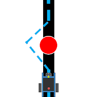

[//]: # "slide Markdown for remark"

# 避障重點

.row[
.col-7[

.blockquote.warning[

.title[小貼士]

- 避障操作後要回歸到本來的行走方向
- 注意不要在避障路線上碰到別的障礙  
  保持避障路線不要太大
- 連繼避障用一左一右的方法*（怎樣做？）*
- 按障礙擺放可選先左或先右

前面容錯度指的就是頭兩點  
有方法可以**同時**做到嗎?
]
]

.col-5[

]
]

---

# 簡單避障

.center[

]

---

# 避障方式

.row[
.col-4.center[

    速度：慢
    難度：易
    容錯度：較大

[avoidance_rect.sb2](./programs/avoidance/avoidance_rect.sb2)

]
.col-4.center[

    速度：中
    難度：易
    容錯度：中

[avoidance_triangle.sb2](./programs/avoidance/avoidance_triangle.sb2)

]
.col-4.center[

    速度：較快
    難度：較難
    容錯度：小

]
]

---

# 每隻mBot 都很獨特

電量會影響mBot 的行走速度，因而影響個別的延時

.blockquote.warning[

.title[小貼士：微調項目]

- 前行速度
- 轉向速度
- 前行時間 (`forwardDelay`)
- 橫行時間 (`lateralDelay`/`turnDelay`)
- 觸發避障的距離

]

.footnote[
我們始終是參加比賽，降低前行和轉向速度是最後手段
]

---

# 避障難點

- 在測試中我發現**同一速度和等待時間**  
  都會轉到**不同的⻆度**
- 我嘗試加上數碼磁力儀（指南針）  
  但磁力儀本身不太準確

---

# 參考資料

- [mBot 與 STEM 的教學: mBot 入門教學：mBot 循跡車](https://mbotandstem.blogspot.com/2017/04/mbot-line-follow-car.html)
