[//]: # "slide Markdown for remark"

class: center, middle

# mBlock 基本使用

---

# 事前準備

1. 使用 USB 數據線將 mBot 與電腦連接起來
2. 確保 mBot 已接上電，並且電源開關是在"On"
3. 選擇"連接"，"序列埠"，選擇與你的 mBot 相對應的埠 (COM1 以外的通常就是)
4. 選擇"控制板"，"Makeblock"下選擇"mBot (mCore)"
5. 選擇"擴充"，確認選擇了"Makeblock"  
   已啟用的擴充都放在機器人模組下

.blockquote.warning[

.title[小貼士]

只要連接到 mBot，即使電源開關是在"Off"，mBlock 也會顯示"已連接"，不要忘記**打開電源開關**喔

]

---

class: img-100

.row[
.col-6[
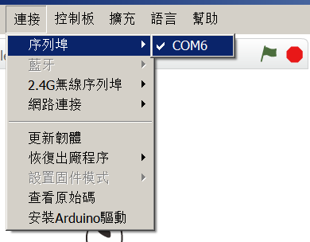
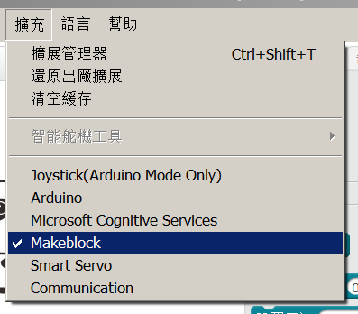
]
.col-6[
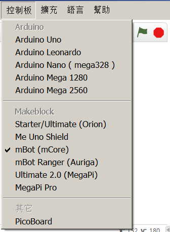
]
]

---

class: img-100

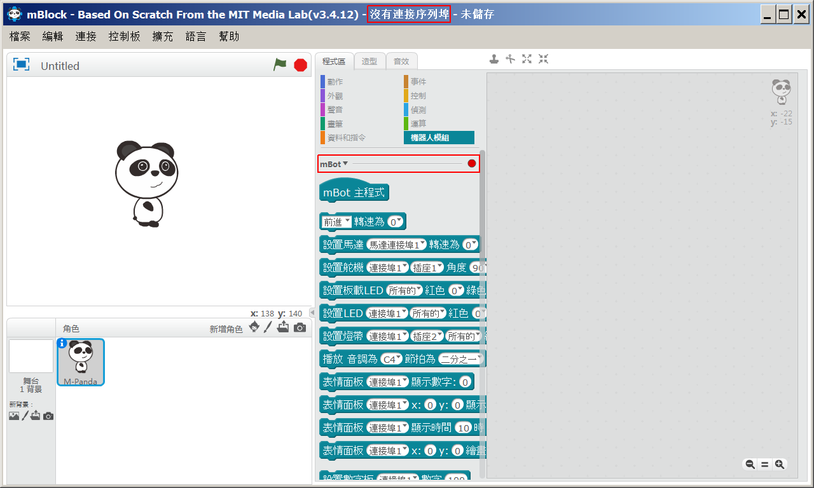

---

class: img-100

---

# 編程模式

1. 在線模式  
   可以使用 mBot 的機器人模組和 Scratch 的場景，角色積木  
   mBot 要以USB/藍牙/2.4G無線跟電腦保持連接，可用於調試傳感器回傳數值
2. 離線模式 (Arduino 模式)  
   不能使用 Scratch 的場景，角色積木  
   把程序放到 mBot，讓 mBot 可以自主運作

---

class: img-100

# 在線模式

- 在線模式**必須**要用出廠的韌體
- 選擇"連接"，"更新韌體"
- 用 Scratch 事件模組的 Hat 積木來開始你的程序
- 可以有多個Hat 積木

.row[
  .col-6[
    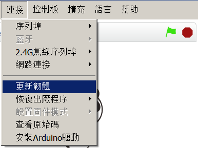
  ]
  .col-6.center[
    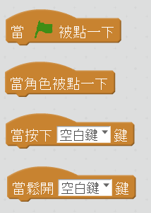
  ]
]

---

# 離線模式 (Arduino 模式)

1. 用機器人模組 mBot 的 Hat 積木來開始你的程序
2. 在"mBot 主程序" 積木上點滑鼠右鍵，"上傳Arduino程式"
3. 在彈出的Arduino 板面點"上傳到Arduino"
4. 日誌會一直有輸出，等待上傳完成

.blockquote.danger[

.title[棄用警告]

新版的 mBlock 5 中棄用了 mBlock 3 中部份積木  
本課程會避免使用該批積木

]
.blockquote.warning[

.title[小貼士]

離線模式會覆蓋出廠的韌體，切換到在線模式時要重新寫入

]

---

class: img-100

.center[
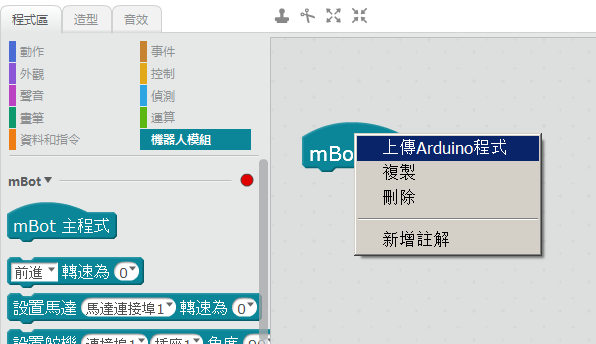

只可以有一個"mBot 主程序" 積木
]

---

class: img-100

.center[
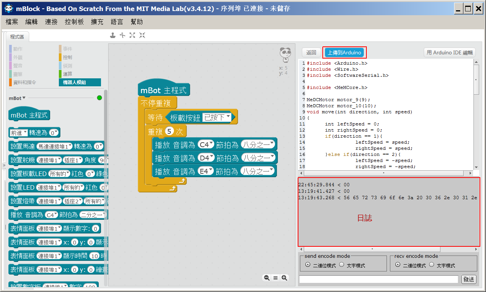

點"返回"回到Scratch 在線模式
]

---

class: img-100

.center[
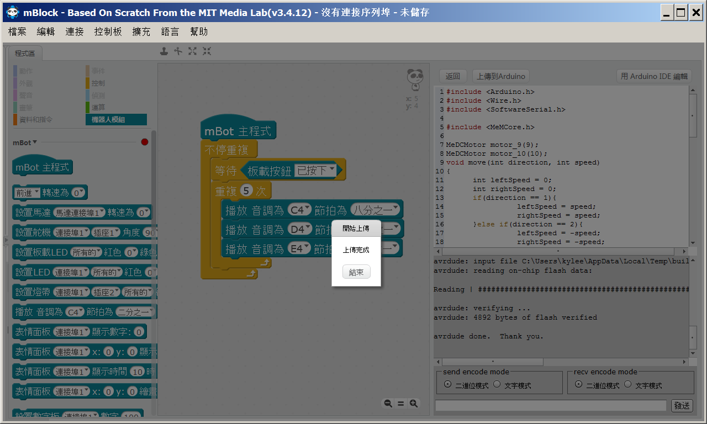
]

---

class: center, middle

# mBot 編程

---

class: img-100

.center[
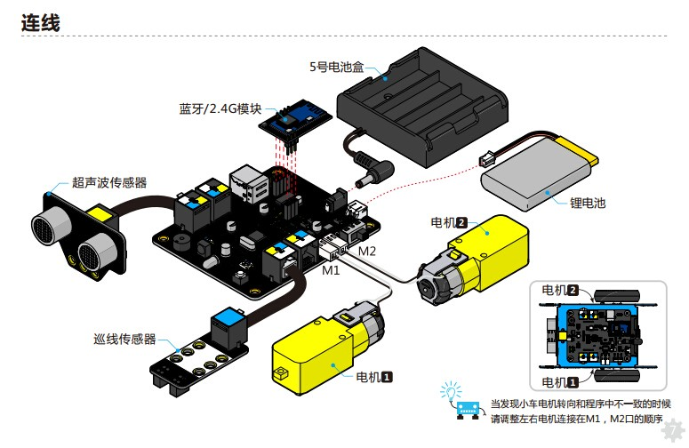
]

---

class: img-75

.center[
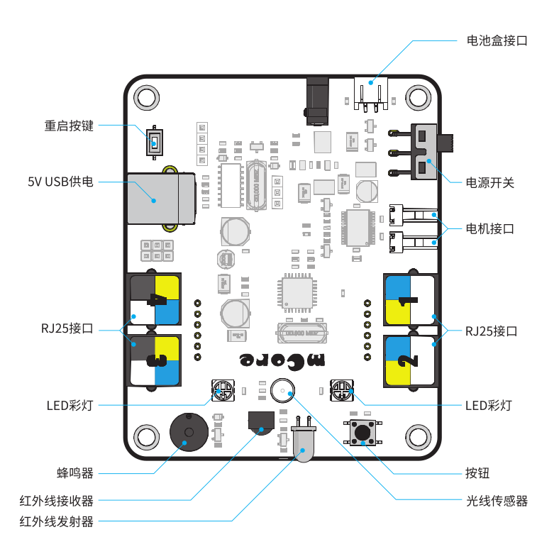
]

---

# mBot 編程

- 測量距離
- 蜂鳴器
- 警報  
  物體接近時發出尖叫

---

class: img-100

.center[

]

"說"積木在外觀模組下，是Scratch 的⻆色積木  
只能在在線模式使用，在離線模式要移除，否則會報錯

---

class: img-100

.row[
  .col-6[
    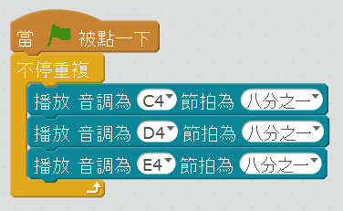
  ]
  .col-6[
    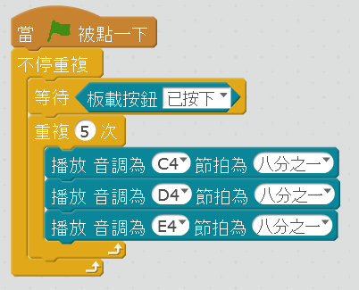
  ]
]

.footnote[
[buzzer1.sb2](./programs/basics/buzzer1.sb2)  
[buzzer2.sb2](./programs/basics/buzzer2.sb2)  
[mbot_buzzer.sb2](./programs/basics/mbot_buzzer.sb2)
]

---

class: img-100

.center[
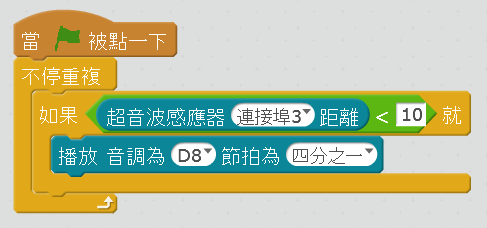
]

.footnote[
[alert.sb2](./programs/basics/alert.sb2)  
]

---

# 前進後退

.blockquote.warning[

.title[小貼士]

我們所有用馬達的程序一開始都要等待板載按鈕按下，避免 mBot 一開機就發狂亂跑。

.center[

]

]

---

class: img-100

# 轉向

.center[
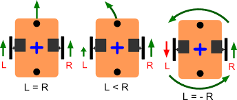
]

.row[
  .col-4.center[
    前進  
    Forward
  ]
  .col-4.center[
    差速左轉  
    Turn Left
  ]
  .col-4.center[
    原地左轉  
    Spin Left
  ]
]

---

# 轉向積木

.center.img-100[

]

--

.row[
  .col-6.center[
    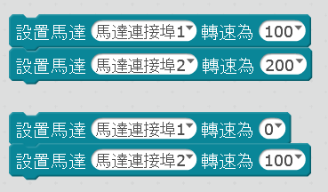
    差速左轉
  ]
  .col-6.center[
    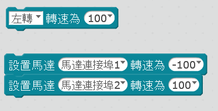
    原地左轉
  ]
]

---

# 轉圈速度

- 我們來量一下mBot 的轉圈速度 (日後有用)
- [stopwatch - Google Search](https://www.google.com/search?q=stopwatch)

---

class: img-75

# mBot 曱甴

.center[
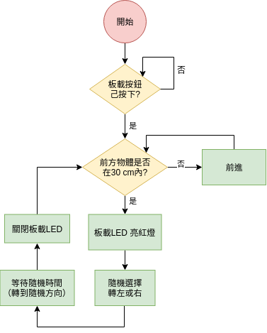
]

---

class: img-75

# mBot 曱甴

.center[
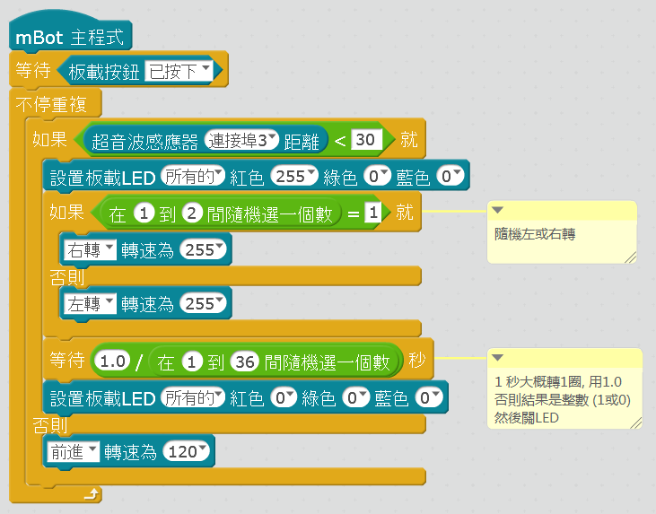
]

.footnote[
[cockroach.sb2](./programs/basics/cockroach.sb2)  
]

---

# 參考資料

- [Getting Started: Programming with mBlock - makeblock education](http://education.makeblock.com/resource/getting-started-programming-mblock/) ([PDF下載](./Getting Started with mBlock.pdf))
- [mBlock 3 官方示例（合集） - makeblock education](http://education.makeblock.com/zh-hans/resource/mblock-3-examples/)
- [mBot - YouTube](https://www.youtube.com/playlist?list=PL0SbEqiUD3gxR2nv5ZcHzFudksPz6e2tc) 粵語
