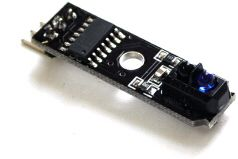
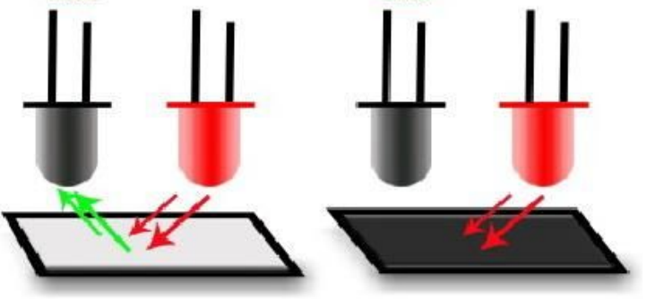
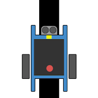
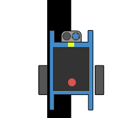
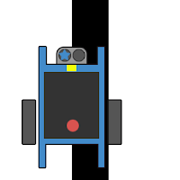
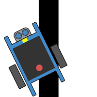

[//]: # "slide Markdown for remark"

class: img-100

# 循跡模塊

.row[
.col-6[

]
.col-6[

]
]

---

# 循跡模塊

- 紅外傳感器模塊是由一對紅外管組成的，一個發出紅外線一個負責接收。  
- 根據不同顏色的物體對光線的反射能力不同，接收端會輸出不同電平。

- 反射光線較少 (檢測到黑線)：  
  循跡模塊相應的指示燈亮，端口電平為LOW (0)

- 反射光線較多 (未檢測到黑線)：  
  循跡模塊相應的指示燈滅，端口電平為HIGH (1)

---

class: img-75

.center[

]

---

class: img-50

.small[
| 左感測器 | 右感測器 |                                              | 動作  |
| :------: | :------: | :------------------------------------------: | :---: |
|    黑    |    黑    |  |       |
|    黑    |    白    |  |       |
|    白    |    黑    |  |       |
|    白    |    白    |  |       |
]

---

class: center, middle

# mBlock 編程

.footnote[
`mb2` project
]

---

class: center, middle

# 虛線怎麽辦？

---

class: center, middle

# 角度大怎麽辦？

---
