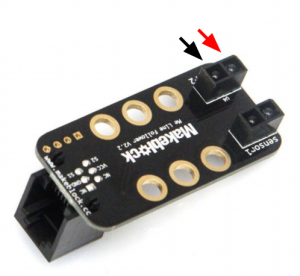
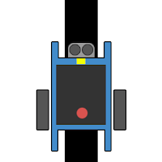
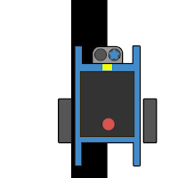
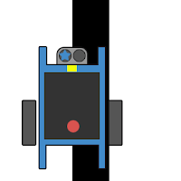
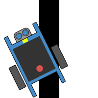
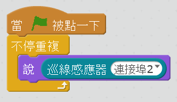
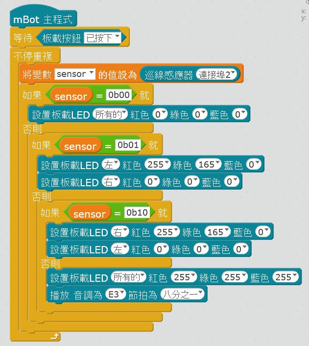
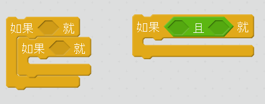
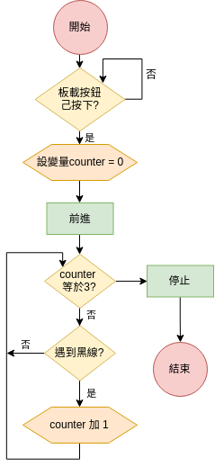
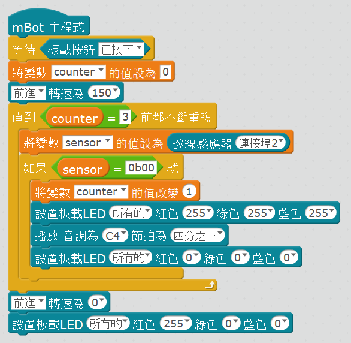

[//]: # "slide Markdown for remark"

class: center, middle

# 基本循跡

---

class: img-100

# 循跡模塊

.row[
.col-6[

]
.col-6[
  

]
]

---

# 循跡模塊

.row[
.col-6[

- 紅外感應器模塊是由一對紅外管組成的，一個發出紅外線一個負責接收
- 根據不同顏色的物體對光線的反射能力不同，接收端會輸出不同電平

]
.col-6.img-100[

]
]

- 反射光線較少 (檢測到黑線)：  
  循跡模塊相應的指示燈**滅**，端口電平為**LOW (0)**
- 反射光線較多 (未檢測到黑線)：  
  循跡模塊相應的指示燈**亮**，端口電平為**HIGH (1)**

---

class: img-40

| 左感應器 | 右感應器 |                                     | 動作 |
| :------: | :------: | :---------------------------------: | :--: |
|    黑    |    黑    |  | 前進 |
|    黑    |    白    |  | 左轉 |
|    白    |    黑    |  | 右轉 |
|    白    |    白    |  |  ？  |

---

class: center, middle

# mBlock 編程

---

# 循跡模塊回傳

| 左感應器 | 右感應器 | 十進制 | 二進制 |
| :------: | :------: | :----: | :----: |
|    黑    |    黑    |  `0`   | `0b00` |
|    黑    |    白    |  `1`   | `0b01` |
|    白    |    黑    |  `2`   | `0b10` |
|    白    |    白    |  `3`   | `0b11` |

.center[

]

.footnote[
.row[
.col-5[
`0b`: 二進制 (Binary) 前綴  
`0o`: 八進制 (Octal) 前綴
]
.col-6[
`0x`: 十六進制 (Hexadecimal) 前綴
]
]
]

---

class: img-100

# 在 mBlock 使用二進制

.row[
.col-7[

]
.col-5[
.blockquote.danger[

.title[離線模式限定]

`0b`前綴只在離線模式生效

]

- 用二進制可以直觀的看到循跡狀態
- 不使用馬達的離線程序不用拔 USB 線
  ]
  ]

.footnote[
[binary.sb2](./programs/tracking/binary.sb2)  
]

---

class: img-100

# 邏輯運算積木

.row[
.col-6[

]
.col-6[
左邊三個 if 裏面的積木（區塊）都可能被執行  
右邊三個區塊只可以有一個被執行
]
]
.row[
.col-6[

]
.col-6[
右邊把兩個 if 的條件用"且"積木合併起來
]
]

---

# 基本循跡

- 前進到黑線停止
- 走曲線
- 簡單地圖

.blockquote.warning[

.title[小貼士]

我們所有用馬達的程序一開始都要等待板載按鈕按下，避免 mBot 一開機就發狂亂跑。

.center[

]

]

---

# 轉向

.center.img-100[

]

.row[
.col-6.center[

差速左轉
]
.col-6.center[

原地左轉
]
]

---

.blockquote.warning[

.title[小貼士：循跡程序]

- 做判別時要把循跡狀態先存起來，mBot 一直在動，每次感應器回傳可能會不一樣的
- 前進和轉向速度不要相差太遠，否則 mBot 會走得搖搖晃晃
- 應該用嵌套的"如果 否則 "，因為每個區塊只處理一種循跡狀態
- 寫了第一個區塊後可以用右鍵，複製貼到第二個區塊
- 直接用`binary.sb2` 來開始吧

.title[小貼士：可調整的項目]

- 前行速度
- 轉向速度
- 差速左轉 vs 原地左轉
- 轉向後加"等待"_（結果是？）_
- "不停重複"最尾加"等待"_（跟上一項一樣嗎？）_
- 一直轉向直到找到黑線

]

---

class: img-50

.center[

]

.footnote[
[basic_tracking1.sb2](./programs/tracking/basic_tracking1.sb2)  
[basic_tracking2.sb2](./programs/tracking/basic_tracking2.sb2) 一直轉向直到找到黑線
]

---

# 記錄狀態

- 前進到第三條黑線停止，並*停止程序*
- 我們需要新增變數來記錄經過的黑線數目

.blockquote.success[

.title[你來試試吧]

限時十分鐘

]

---

# 流程圖

.center[

]

---

# 停止程序

.center[

如果程序要按某些條件停止，我們會用  
"直到　前都不斷重複"積木
]

---

# 重跑程序

.center[

如果我們要重跑程序，可以在外層再加一個"不停重覆"積木  
注意每次循環開始還是會先等待板載按鈕按下
]

---

.center[

]

.footnote[
[three_lines.sb2](./programs/tracking/three_lines.sb2)  
]

---

class: center, middle

# 角度大怎麽辦？

---

# 大角度處理（左轉）

- 循跡模塊會碰到白色（`0b11`）
- 往左轉直至重新找到黑線

.blockquote.warning[

.title[小貼士]

- 碰到白色可以稍為繼續前行一點再轉向*（怎樣做？）*

]

---

.center[

]

.footnote[
[saving_left.sb2](./programs/tracking/saving_left.sb2)
]

---

# 參考資料

- [Binary numbers on Scratch](https://scratch.mit.edu/projects/29447030/)
- [Decimal-hexadecimal-binary conversion table](https://kb.iu.edu/d/afdl)
- [How binary digits work - CS Unplugged](https://csunplugged.org/en/topics/binary-numbers/unit-plan/how-binary-digits-work/)

* [mBot 與 STEM 的教學: mBot 入門教學：mBot 循跡車](https://mbotandstem.blogspot.com/2017/04/mbot-line-follow-car.html)
* [mBot 教學(8) - 巡線控制應用](https://www.slideshare.net/sshiouwu/mbot8-87982223)
