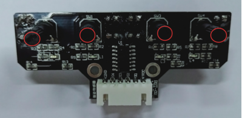

[//]: # "slide Markdown for remark"

class: center, middle

# 多路感測器

---

# 三路感測器
 

---

# 三路感測器 

.small[

| 左感測器 | 前感測器 | 右感測器 |   動作   |
| :------: | :------: | :------: | :------: |
|    白    |    白    |    白    |   直走   |
|    白    |    黑    |    白    |   直走   |
|    白    |    白    |    黑    |   右轉   |
|    白    |    黑    |    黑    | 向右微調 |
|    黑    |    白    |    白    |   左轉   |
|    黑    |    黑    |    白    | 向左微調 |
|    黑    |    白    |    黑    |    ?     |
|    黑    |    黑    |    黑    |    ?     |

]

---

# 四路感測器

.center[

]

---

class: img-75

# 非黑即白?

--

.center[

]

---

class: img-75

# 非黑即白?

.center[

]

---

# 校正

.center[

]

- 把四個可調電阻都扭到最左
- 逐個可調電阻微調，令到相應的指示燈  
  在白色表面滅，在黑線上亮

---

# 四路感測器

.small[

| 左感測器 | 前左感測器 | 前右感測器 | 右感測器 |   動作   |
| :------: | :--------: | :--------: | :------: | :------: |
|    白    |     白     |     白     |    白    |   直走   |
|    白    |     黑     |     黑     |    白    |   直走   |
|    白    |     白     |     白     |    黑    |   右轉   |
|    白    |     白     |     黑     |    黑    |   右轉   |
|    白    |     黑     |     黑     |    黑    |   右轉   |
|    白    |     白     |     黑     |    白    | 向右微調 |
|    黑    |     白     |     白     |    白    |   左轉   |
|    黑    |     黑     |     白     |    白    |   左轉   |
|    黑    |     黑     |     黑     |    白    |   左轉   |
|    白    |     黑     |     白     |    白    | 向左微調 |
|    黑    |     白     |     白     |    黑    |    ?     |
|    黑    |     黑     |     黑     |    黑    |    ?     |

]

---

# mBot 編程

.row[
.col-8[

.blockquote[
.title[小貼士]
機器人模組下有Arduino 和mBot 兩類積木，你可以隱藏Arduino積木
]
]

.col-4[

]
]
