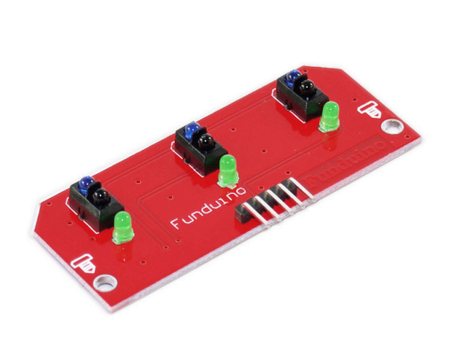
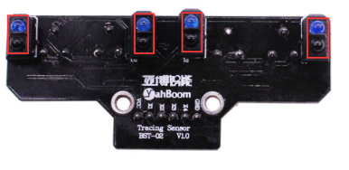
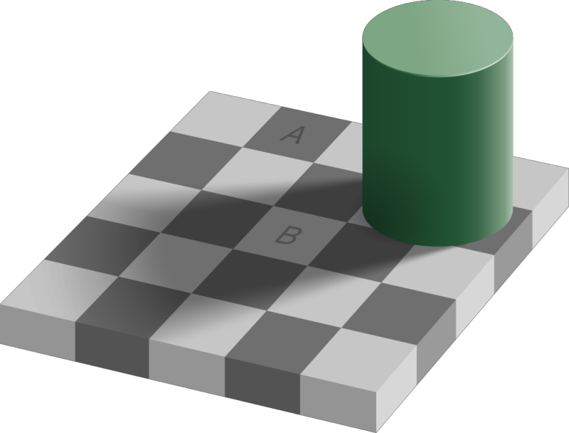
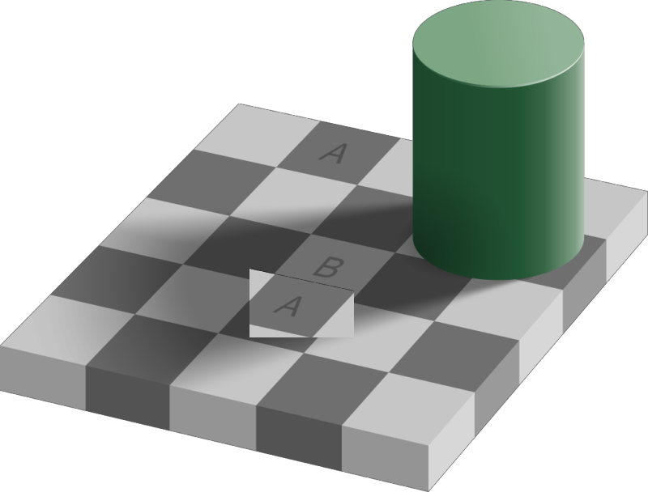
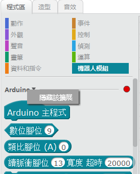

[//]: # "slide Markdown for remark"

class: center, middle

# 多路感應器

---

# 三路感應器

.center[

]

---

# 三路感應器 

.small[

| 左感應器 | 前感應器 | 右感應器 |   動作   |
| :------: | :------: | :------: | :------: |
|    白    |    白    |    白    |   直走   |
|    白    |    黑    |    白    |   直走   |
|    白    |    白    |    黑    | 原地右轉 |
|    白    |    黑    |    黑    | 向右微調 |
|    黑    |    白    |    白    | 原地左轉 |
|    黑    |    黑    |    白    | 向左微調 |
|    黑    |    白    |    黑    |    ?     |
|    黑    |    黑    |    黑    |    ?     |

]

---

# 四路感應器

.center[

]

---

class: img-75

# 非黑即白？

--

.center[

]

---

class: img-75

# 非黑即白？

.center[

]

---

# 校正

.center[

]

- 把四個可調電阻都扭到最**左**
- 逐個可調電阻微調，令到相應的指示燈  
  **在白色表面滅，在黑線上亮**

---

# 四路感應器

.smaller[

| 感應器 (左 ⮕ 右) | 十進制 |  二進制  |   動作   |
| :--------------: | :----: | :------: | :------: |
|   白 白 白 黑    |  `14`  | `0b1110` | 原地右轉 |
|   白 白 黑 黑    |  `12`  | `0b1100` | 原地右轉 |
|   白 黑 黑 黑    |  `8`   | `0b1000` | 原地右轉 |
|   黑 白 白 白    |  `7`   | `0b0111` | 原地左轉 |
|   黑 黑 白 白    |  `3`   | `0b0011` | 原地左轉 |
|   黑 黑 黑 白    |  `1`   | `0b0001` | 原地左轉 |
|   白 白 黑 白    |  `13`  | `0b1101` | 向右微調 |
|   白 黑 白 白    |  `11`  | `0b1011` | 向左微調 |

]

---

# 四路感應器

.smaller[

| 感應器 (左 ⮕ 右) | 十進制 |  二進制  |    動作     |
| :--------------: | :----: | :------: | :---------: |
|   白 白 白 白    |  `15`  | `0b1111` | 虛線/大角度 |
|   白 黑 黑 白    |  `9`   | `0b1001` |    直走     |
|   黑 白 白 黑    |  `6`   | `0b0110` |    分岔     |
|   黑 白 黑 黑    |  `4`   | `0b0100` |    分岔     |
|   黑 黑 白 黑    |  `2`   | `0b0010` |    分岔     |
|   黑 黑 黑 黑    |  `0`   | `0b0000` |   停止？    |
|   黑 白 黑 白    |  `5`   | `0b0101` |      ⨯      |
|   白 黑 白 黑    |  `10`  | `0b1010` |      ⨯      |

]

---

# mBot 編程

.row[
.col-8[

  .blockquote.warning[

  .title[小貼士]

  機器人模組下有Arduino 和mBot 兩類積木，你可以隱藏Arduino積木
  ]
]

.col-4[

]
]
