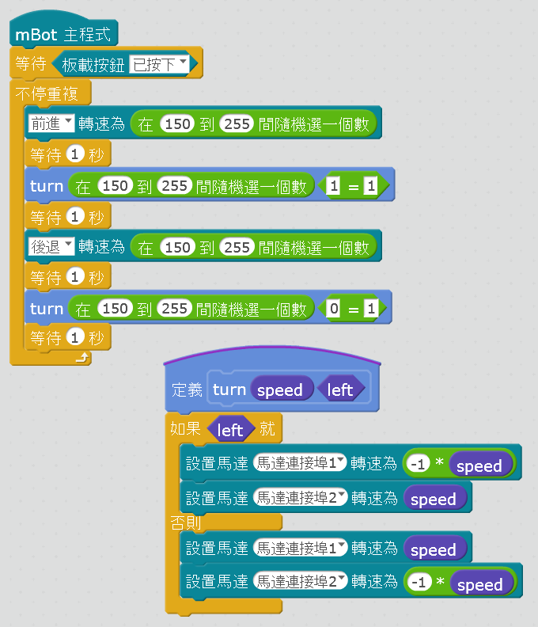

[//]: # "slide Markdown for remark"

class: center, middle

# 進階循跡

---

class: center, middle

# 虛線怎麽辦？

---

# 虛線處理

- 在有虛線的地圖，不能一碰到白色就觸發大角度處理
- mBlock 有一個一直在跑的計時器，單位是秒
- 碰到白色時記下狀態，把計時器歸零
- 碰到黑線就把白色狀態歸零
- 不停作以下檢測：  
  如白色狀態不是零（一直在白色上）  
  **而且**當前計時器超過指定值（例如`x`秒）  
  那我們真的跑出賽道了，這樣才觸發大角度處理

- 超時值是怎樣定的？  
  mBot 要在超時值內走過虛線，讓計時器歸零，  
  否則會誤觸發大角度處理  
  但亦*不能太大*，否則在大角度時會跑得太遠

---

class: img-100

# 指令積木

- 我們可以自定義指令積木（函數），把大角度處理（左轉）區塊放到裡面，方便重用

.row[
.col-6.center[

]
.col-6.center[

]
]

---

class: img-100

.row[
.col-8.offset-2[

]
]

.footnote[
[dashline_left.sb2](./programs/tracking/dashline_left.sb2)
]

---

# 大角度處理（通用）

- 記下當前的計時器
- 往**左轉**直至：
  - 重新找到黑線 **或**
  - 當前計時器比記錄超過指定值（例如`x`秒）
- 如果超時都沒有在左邊找到黑線，就往**右轉**直至：
  - 重新找到黑線 **或**
  - 當前計時器比記錄超過指定值（例如`2x`秒）  
     `2x`是先用`x`秒回中，再往右轉`x`秒  
--
- 如果超時都沒有在右邊找到黑線．．．_我們迷路了_

* 超時值是怎樣定的？  
  超時值太小會找不到黑線，大則要找右邊黑線會很慢  
  最大是令 mBot 轉＜ 180° 就夠了

---

class: img-100

- 左轉後檢查循跡狀態
- 大角度處理後再檢查循跡狀態
- 可用較高的轉向速度

.footnote[
[saving_move.sb2](./programs/tracking/saving_move.sb2)
]

---

class: img-75

# Frankie Wong 的程序

.center[

用轉向次數比較難理解成轉向角度
]

.footnote[
[mBot 與 STEM 的教學: mBot 入門教學：mBot 循跡車](https://mbotandstem.blogspot.com/2017/04/mbot-line-follow-car.html)
]

---

# 大角度處理後的前進

- 最後的前進不一定跟黑線對上．．．  
- 通常都轉過頭了☹ _（為什麽？）_

--

- 我們用原地左／右轉來找黑線，找到黑線但⻆度偏了
- mBot 中心要跟轉角位置對上來原地轉才能跟黑線對上

.blockquote.warning[

.title[小貼士：可調整的項目]

- 前行速度
- 虛線處理中觸發大角度處理的超時
- 觸發大角度處理時先後退

]

.footnote[
加上循跡後亦可幫助處理這偏差
]

---

class: center, middle

# BOSS 戰

---

class: center, middle, img-75

# 小頭目

150cm x 200cm

---

class: center, middle, img-100

# 最終BOSS

110cm x 460cm

---

class: center, middle

# 裝備

---

class: img-50

.center[

]

.footnote[
基本循跡：[basic_tracking1.sb2](./programs/tracking/basic_tracking1.sb2)  
]

---

class: middle, img-100

.row[
.col-8.offset-2[

]
.col-2[

]
]

.footnote[
虛線處理：[dashline_left.sb2](./programs/tracking/dashline_left.sb2)
]

---

class: middle, img-100

.footnote[
大角度處理：[saving_move.sb2](./programs/tracking/saving_move.sb2)
]

---

class: center, middle

# 合體

---

class: middle, img-100

.center[
慢車參數
]

.footnote[
循跡程序：[tracking.sb2](./programs/tracking/tracking.sb2)
]

---

class: middle, img-100

.center[
快車參數
]

.footnote[
循跡程序：[tracking.sb2](./programs/tracking/tracking.sb2)
]

---

class: middle, center, img-100

---

# 每隻mBot 都很獨特

電量會影響mBot 的行走速度，因而影響個別的超時值和延時

.blockquote.warning[

.title[小貼士：微調項目]

- 前行速度
- 轉向速度
- 觸發大角度處理的超時 (`savingTimeout`) [#虛線]
- 觸發大角度處理時後退的延時 ("等待"的參數) [#大角度]
- 大角度處理轉向的超時 (`FindBlackLine()` 的參數) [#大角度]
- 調整後首先測試**虛線**和**大角度**
- 目標是盡量小作大角度處理，令行車更順暢

]

.footnote[
我們始終是參加比賽，降低前行和轉向速度是最後手段
]

---

class: center, middle

# 多路感應器

## 挑戰題

---

# 三路感應器

.center[

]

---

# 三路感應器

.small[

| 左感應器 | 前感應器 | 右感應器 |   動作   |
| :------: | :------: | :------: | :------: |
|    白    |    白    |    白    |   直走   |
|    白    |    黑    |    白    |   直走   |
|    白    |    白    |    黑    | 原地右轉 |
|    白    |    黑    |    黑    | 向右微調 |
|    黑    |    白    |    白    | 原地左轉 |
|    黑    |    黑    |    白    | 向左微調 |
|    黑    |    白    |    黑    |    ?     |
|    黑    |    黑    |    黑    |    ?     |

]

---

# 四路感應器

.center[

]

---

class: img-75

# 非黑即白？

--

.center[

]

---

class: img-75

# 非黑即白？

.center[

]

---

# 校正

.center[

]

- 把四個可調電阻都扭到最**左**
- 逐個可調電阻微調，令到相應的指示燈  
  **在白色表面滅，在黑線上亮**

.smaller[
數碼輸出跟mBot 巡線感應器**相反**

- 反射光線較少 (檢測到黑線)：  
  循跡模塊相應的指示燈**亮**，端口電平為**HIGH (1)**
- 反射光線較多 (未檢測到黑線)：  
  循跡模塊相應的指示燈**滅**，端口電平為**LOW (0)**
]

---

# 校正

.center[

]

- 把可調電阻扭到最**左**
- 把可調電阻微調，令到相應的指示燈  
  **在白色表面亮，在黑線上滅**

.smaller[
數碼輸出跟mBot 巡線感應器**相反**

- 反射光線較少 (檢測到黑線)：  
  循跡模塊相應的指示燈**滅**，端口電平為**HIGH (1)**
- 反射光線較多 (未檢測到黑線)：  
  循跡模塊相應的指示燈**亮**，端口電平為**LOW (0)**
]

---

# 四路感應器

.smaller[

| 感應器 (左 ➡ 右) | 十進制 |  二進制  |   動作   |
| :--------------: | :----: | :------: | :------: |
|   白 白 白 黑    |  `14`  | `0b1110` | 原地右轉 |
|   白 白 黑 黑    |  `12`  | `0b1100` | 原地右轉 |
|   白 黑 黑 黑    |  `8`   | `0b1000` | 原地右轉 |
|   黑 白 白 白    |  `7`   | `0b0111` | 原地左轉 |
|   黑 黑 白 白    |  `3`   | `0b0011` | 原地左轉 |
|   黑 黑 黑 白    |  `1`   | `0b0001` | 原地左轉 |
|   白 白 黑 白    |  `13`  | `0b1101` | 向右微調 |
|   白 黑 白 白    |  `11`  | `0b1011` | 向左微調 |

]

---

# 四路感應器

.smaller[

| 感應器 (左 ➡ 右) | 十進制 |  二進制  |    動作     |
| :--------------: | :----: | :------: | :---------: |
|   白 白 白 白    |  `15`  | `0b1111` | 虛線/大角度 |
|   白 黑 黑 白    |  `9`   | `0b1001` |    直走     |
|   黑 白 白 黑    |  `6`   | `0b0110` |    分岔     |
|   黑 白 黑 黑    |  `4`   | `0b0100` |    分岔     |
|   黑 黑 白 黑    |  `2`   | `0b0010` |    分岔     |
|   黑 黑 黑 黑    |  `0`   | `0b0000` |   停止？    |
|   黑 白 黑 白    |  `5`   | `0b0101` |      ⨯      |
|   白 黑 白 黑    |  `10`  | `0b1010` |      ⨯      |

]

---

# 如何使用多出的感應器

- 16個if 積木較難在mBlock 編程
- 其實多出的感應器（最左和最右）主要是用來  
  估計大角度處理的轉向方向
- 我們可以沿用先前的循跡程序，獨立處理這兩個感應器，把它們的值存下來
- 再把`FindBlackLine()`分為**先左**和**先右**版  
- 在大角度處理時按這兩個感應器的最近值來調用合適的版本
